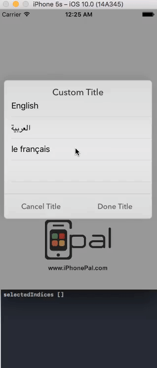

# Multi Picker Dialog

Multi Picker Dialog is a customizable class that displays a UItableView with multiSelection option in a dialog
for iOS apps.  This project builds on [iOS-PickerDialog](https://github.com/aguynamedloren/ios-picker-dialog),
a picker dialog developed by [aguynamedloren](https://github.com/aguynamedloren).



## Adding to your project

Copy the `MultiPickerDialog.swift` file into your project.  Modify to fit your needs.

## Example Usage

```swift
@IBAction func clicked(_ sender: UIButton) {
        
        
        let pickerData : [[String:String]] = [
            [
                "value":"en",
                "display":"English"
            ],
            [
                "value":"ar",
                "display":"العربية"
            ],
            [
                "value":"fr",
                "display":"le français"
            ]
        ]
        
        
        
        MultiPickerDialog().show("Custom Title",doneButtonTitle:"Done Title", cancelButtonTitle:"Cancel Title" ,options: pickerData, selected:  self.selectedIDs) {
            values -> Void in
            //print("SELECTED \(value), \(showName)")
            print("callBack \(values)")
            var finalText = ""
            self.selectedIDs.removeAll()
            for (index,value) in values.enumerate(){
                self.selectedIDs.append(value["value"]!)
                finalText = finalText  + value["display"]! + (index < values.count - 1 ? " , ": "")
            }
            sender.titleLabel?.text = finalText
        }

    }

```

## Parameters

* title: String (Required)
* doneButtonTitle: String
* cancelButtonTitle: String
* selected: String (Default picker value)
* callback: ((value: String) -> Void) (Required)


## Special thanks to

* [@Squimer](https://github.com/squimer) for the [DatePickerDialog-iOS-Swift](https://github.com/squimer/DatePickerDialog-iOS-Swift) project.
* [@wimagguc](https://github.com/wimagguc) for the work with [ios-custom-alertview](https://github.com/wimagguc/ios-custom-alertview) library.

## License

This code is distributed under the terms and conditions of the [MIT license](LICENSE).
